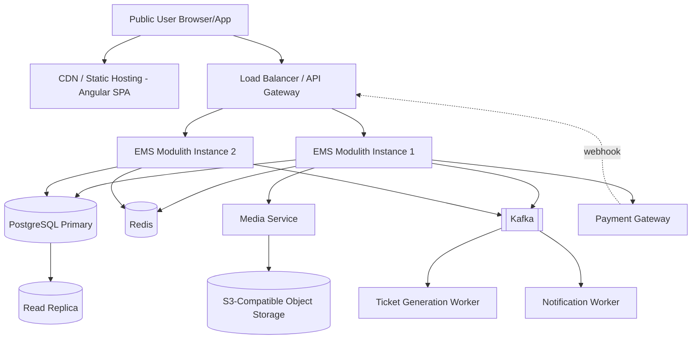

# Event Management System — Senior-Level Production Architecture & Implementation Plan
### India-focused platform · MVP → Production → Scale


## 1. Executive Summary

This document designs a production-grade Event Management System (EMS) for the Indian market, covering event discovery, registration, payments, ticketing, and event administration for three roles: Super Admin, Admin (organizer), and End User.

The core architectural bet: **start with a modular monolith, not microservices**, and split out services only when a concrete scaling or team-ownership pressure justifies it. This is the single biggest deviation from the brief as written, and it's argued for explicitly in §4 and §28. Everything downstream (deployment, cost, CI/CD) is built around that decision, with an explicit extraction path to real microservices once traffic or team size demands it.

Target: 500 RPS sustained, with clear headroom to scale past it without a rewrite.

---

## 2. Functional Requirements (summary)

- **Super Admin**: manage admins, users, platform-wide stats, audit trail, full access.
- **Admin**: CRUD on their own events (title, description, date/time, venue + map location, media, activities, meals, capacity), view registrations/payments/analytics for their events, reply to comments.
- **Public User**: browse/search events unauthenticated; must log in to comment, register, pay; view/download tickets and registration history.

## 3. Non-Functional Requirements

| Requirement | Target |
|---|---|
| Throughput | 500 RPS sustained, bursty to 2–3x on popular event drops |
| Availability | 99.5% MVP → 99.9% production |
| Payment consistency | Zero double-charges, zero overselling, at-least-once with idempotent processing |
| Latency | p95 < 300ms for reads, < 800ms for write/payment-initiation paths |
| Data durability | No lost registrations/payments even under partial failure |
| Security | OWASP Top 10 covered, PII minimized and encrypted at rest |
| Cost | MVP running cost under ~₹15–25k/month infra spend |

---

## 4. Architecture Decisions — and where I'm pushing back on the brief

**Do we need microservices from day one? No.**
At 500 RPS with a small team, a well-structured **modular monolith** (single Spring Boot deployable, clean package-per-domain boundaries: `event`, `registration`, `payment`, `ticket`, `user`, `media`, `comment`, `notification`, `admin`) beats microservices on every axis that matters early: deployment simplicity, transaction consistency (registration+payment+ticket is naturally transactional), debugging, and operational cost. Microservices buy you independent scaling and independent deployability — neither of which you need until you have a team big enough to own separate services, or a component (media processing, notifications) with wildly different scaling characteristics than the rest.

500 RPS is genuinely modest for a single well-tuned JVM service behind a load balancer with a couple of replicas — this is not a "need Kubernetes and 12 services" problem, it's a "need good indexes, connection pooling, and horizontal replica scaling" problem.

**What I'd actually split out immediately, as separate deployables (not because of RPS, but because of genuinely different concerns):**
- **Media service** — different resource profile (I/O heavy, large payloads), benefits from independent scaling and can talk directly to S3.
- **Notification worker** — pure async consumer, no need to live in the request path.

Everything else (auth, event, registration, payment orchestration, ticket, comment, admin, reporting) stays in one Spring Boot modulith **for MVP and Production phases**, with package boundaries enforced (e.g., via ArchUnit) so each module could be lifted into its own service later with minimal rewrite — only the wiring (in-process calls → REST/Kafka) changes, not the domain logic.

**Do we need Kafka everywhere? No — but yes for specific things.**
Kafka is justified for the **payment → registration confirmation → ticket generation → notification** chain because these are genuinely fire-and-forget, tolerate eventual consistency, and benefit from retry/DLQ semantics. Kafka is *not* justified for things like "create event" or "post comment" — those are synchronous CRUD with no downstream fan-out that needs decoupling. Using Kafka there just adds latency and operational complexity with no payoff.

**Do we need Kubernetes initially? No.** See §19 — justified only once you have several independently-scaled services and a team able to operate it. Not before.

**PostgreSQL as the single primary datastore initially — yes.** Multiple databases (Mongo + Postgres + …) from day one is complexity without payoff; Postgres handles relational data, JSONB handles the few semi-structured fields (activities, meal options) you might otherwise reach for Mongo for.

**Redis** — for distributed rate limiting, hot event-detail caching, and (critically) as part of the concurrency-safe seat-reservation mechanism (§9), not as a general-purpose cache-everything layer.

**Priority ordering used throughout this document, as requested:** Correctness → Security → Reliability → Maintainability → Scalability → Cost.

---

## 5. High-Level Architecture



## 6. Microservice / Module Boundaries

| Module (in-process for MVP/Prod) | Responsibility | Owns tables | Extract to own service when… |
|---|---|---|---|
| Auth/User | login, register, JWT issuance, RBAC | `users`, `roles`, `refresh_tokens` | Team owns identity independently, or SSO needed |
| Event | CRUD events, venue, activities, meals | `events`, `venues`, `activities`, `meals` | — likely stays in modulith long-term |
| Registration | seat reservation, registration lifecycle | `registrations` | Split out once registration volume dwarfs everything else |
| Payment | orchestration with gateway, idempotency ledger | `payments`, `payment_events` | Split early if a second gateway or PCI-scoped isolation is needed |
| Ticket | ticket generation, QR, validation | `tickets` | Rarely needs isolation |
| Comment | comments, moderation | `comments` | Split if spam/volume becomes a distinct scaling problem |
| Admin | admin/super-admin operations, audit | `audit_logs` | — |
| **Media (separate service from day 1)** | uploads, pre-signed URLs, metadata | `media_assets` | Already separate |
| **Notification (separate worker from day 1)** | email/SMS/push via Kafka consumer | — | Already separate |

For each module, dependencies flow inward toward Event/User; Payment depends on Registration, Ticket depends on Payment success — this ordering matters for the transaction design in §9.

---

## 7. Database Design

**Primary DB: PostgreSQL.** Rationale: strong transactional guarantees (critical for registration/payment consistency), mature JSONB support for flexible fields (activities, meal options) without needing a second database, excellent tooling, and it's free/low-cost to run managed on any Indian-region cloud.

**Database-per-service vs shared:** shared schema for the modulith (single DB, module-owned tables, no cross-module foreign-key-free joins enforced by convention), except Media, which already has its own schema/database since it's a separate service.

### Core schema (simplified)

```sql
users(id PK, email UNIQUE, password_hash, phone, status, created_at)
roles(id PK, name)  -- SUPER_ADMIN, ADMIN, USER
user_roles(user_id FK, role_id FK)

events(id PK, admin_id FK->users, title, description, start_at, end_at,
       venue_id FK, capacity INT, seats_remaining INT, status, version INT, created_at)
venues(id PK, name, address, latitude, longitude)
event_media(id PK, event_id FK, media_asset_id FK->media_assets.id, type, sort_order)
activities(id PK, event_id FK, name, start_time, description)
meals(id PK, event_id FK, name, type, description)

comments(id PK, event_id FK, user_id FK, parent_id NULLABLE, body, status, created_at)

registrations(id PK, event_id FK, user_id FK, status, idempotency_key UNIQUE,
              created_at, UNIQUE(event_id, user_id))
payments(id PK, registration_id FK UNIQUE, gateway_order_id UNIQUE, gateway_payment_id,
         amount, currency, status, created_at, updated_at)
payment_events(id PK, payment_id FK, gateway_event_id UNIQUE, payload JSONB, received_at)
   -- gateway_event_id UNIQUE enforces webhook idempotency at the DB level

tickets(id PK, registration_id FK UNIQUE, ticket_code UNIQUE, qr_payload, status, issued_at)

audit_logs(id PK, actor_id FK, action, target_type, target_id, metadata JSONB, created_at)
```

**Key design points:**
- `events.seats_remaining` + `events.version` (optimistic locking column) is the backbone of the concurrency control in §9.
- `registrations` has a `UNIQUE(event_id, user_id)` constraint — the database itself prevents duplicate registration, not just application logic.
- `payment_events.gateway_event_id UNIQUE` makes duplicate webhook delivery a no-op at the DB layer, not something you have to get right in code every time.
- **Indexing:** `events(start_at, status)` for browse/search, `registrations(event_id)`, `payments(gateway_order_id)`, `comments(event_id, created_at)` for paginated feeds.
- **Pagination:** keyset (cursor) pagination on `(created_at, id)` for comments and event listings — avoids the performance cliff of `OFFSET` at scale.
- **Read replicas:** introduced in Production phase for the read-heavy event-browsing traffic, keeping the primary free for writes (registrations/payments).

---

## 8. Authentication & Authorization

- **Login/Register**: email+password (bcrypt/Argon2 hashing), rate-limited.
- **Tokens**: short-lived JWT access token (~15 min) + opaque refresh token stored server-side (hashed) in `refresh_tokens`, enabling real revocation on logout — a pure-JWT refresh token can't be revoked, which is why it's stored server-side rather than as a second JWT.
- **RBAC**: `roles`/`user_roles` tables, enforced via Spring Security method-level `@PreAuthorize`, not just at the gateway — defense in depth.
- **Admin promotion without privilege escalation**: only Super Admin can call `POST /api/v1/admin/promote`; the endpoint is itself restricted to `SUPER_ADMIN` role, every promotion is written to `audit_logs`, and there is no self-service "become admin" path anywhere in the codebase — privilege changes are exclusively a Super-Admin-initiated, audited, server-side action.
- **Password reset**: time-boxed, single-use token emailed via the notification worker, never returned in the API response.
- **Logout/revocation**: deletes the refresh token row; access tokens simply expire (15 min blast radius is acceptable).

---

## 9. Event Registration & Concurrency — the critical section

**Scenario:** 100 seats remaining, 500 concurrent registration attempts.

**Approach: optimistic locking + a short-lived Redis reservation, not naive row locking for the whole flow.**

1. User hits `POST /events/{id}/register`. Server attempts:
   ```sql
   UPDATE events SET seats_remaining = seats_remaining - 1, version = version + 1
   WHERE id = ? AND seats_remaining > 0 AND version = ?
   ```
   This is the atomic seat decrement — the database guarantees exactly `capacity` successful updates, full stop, regardless of concurrency, with zero application-level coordination needed.
2. On success, insert into `registrations` with status `PENDING_PAYMENT` inside the **same transaction**, protected by the `UNIQUE(event_id, user_id)` constraint (prevents duplicate registration attempts from the same user).
3. A short **Redis reservation TTL (e.g., 10 minutes)** is set for that registration — if payment isn't completed in time, a scheduled job releases the seat back (`seats_remaining + 1`) and marks the registration `EXPIRED`. This prevents "abandoned checkout" from permanently locking seats.
4. Payment failure or user retry: the registration stays `PENDING_PAYMENT` until reservation expiry or explicit failure callback — retries reuse the same registration+idempotency key rather than creating a new one.
5. **Last-seat race:** with optimistic locking, only one of the 500 concurrent requests for the last seat succeeds the conditional `UPDATE`; the other 499 get `seats_remaining > 0` = false and receive a clean "sold out" response — no oversell is possible because the check-and-decrement is one atomic statement, not a read-then-write from the application.

**Why not pessimistic row locking (`SELECT ... FOR UPDATE`) for everything?** It works, but under 500 concurrent requests hitting the same row it serializes all of them through lock queues, which is worse for latency than the optimistic conditional update, which fails fast for losers instead of making them wait.

**Duplicate payment / double ticket prevention:** enforced by `payments.registration_id UNIQUE` and `tickets.registration_id UNIQUE` — structurally impossible to generate two tickets or two payment records for one registration, independent of any application bug.

---

## 10. Payment Architecture

Flow, step by step:

1. **User starts registration** → seat reserved as in §9, registration `PENDING_PAYMENT`.
2. **Order creation**: server calls the payment gateway to create an order, stores `gateway_order_id` on `payments` row (status `CREATED`) — this call itself is idempotent, keyed on `registration_id`, so a page refresh doesn't create a second gateway order.
3. **User completes payment** on gateway-hosted page.
4. **Webhook/callback** arrives at `POST /api/v1/payments/webhook`. Server **verifies the gateway's signature first**, before touching any data — unverified webhooks are rejected outright.
5. Insert into `payment_events` keyed on `gateway_event_id UNIQUE` — if this insert fails on the unique constraint, the event is a duplicate delivery and processing stops here, having done nothing (this is what makes double-delivery safe).
6. **Payment succeeds** → update `payments.status = SUCCESS`, publish `PaymentSucceeded` to Kafka within the same transaction outbox (see §11) — the DB write and the event publish are not allowed to disagree.
7. **Ticket generation** consumes `PaymentSucceeded` asynchronously, generates the ticket, publishes `TicketGenerated`.
8. **User receives confirmation** via the notification worker consuming `TicketGenerated`.

**Edge cases, explicitly:**
- **Delayed callback**: registration sits `PENDING_PAYMENT` until the reservation TTL; if the callback arrives after expiry but the seat was already released, the payment is refunded automatically and the user is notified — this is a rare but necessary reconciliation path, not swept under the rug.
- **Duplicate callback**: no-op, per the unique constraint above.
- **Page refresh mid-payment**: idempotent order creation means no duplicate order/charge.
- **Payment succeeds but ticket generation fails**: because ticket generation is a separate async consumer with retry + DLQ, the payment record is already durably `SUCCESS`; the consumer retries ticket generation independently — payment success is never rolled back because a downstream, non-critical-path step failed.
- **Payment fails, user retries**: same registration + a fresh gateway order, old failed payment record kept for audit.
- **Never retry a payment charge automatically** — retrying "did this charge succeed?" against the gateway is safe (idempotent status check), but blindly re-submitting a charge is not. This is the one place in the whole system where automatic retry is explicitly forbidden.

---

## 11. Ticket System

- Ticket generated **asynchronously** (via Kafka consumer on `PaymentSucceeded`) — ticket generation involves QR encoding and possibly a PDF render, neither of which should block the payment response path.
- `ticket_code` is a UUID; QR payload encodes `ticket_code` + a signed hash (HMAC) so validation at the venue doesn't require a database round-trip if offline validation is ever needed.
- `tickets.registration_id UNIQUE` structurally prevents duplicate tickets.
- Validation endpoint checks ticket status (`ISSUED` / `USED` / `REVOKED`) and marks `USED` atomically on check-in.

## 12. Kafka / Event-Driven Architecture

**Topics:**
| Topic | Producer | Consumer(s) | Key | Notes |
|---|---|---|---|---|
| `payment.succeeded` | Payment module | Ticket worker | `registration_id` | Partitioned by registration for ordering |
| `payment.failed` | Payment module | Notification worker | `registration_id` | |
| `ticket.generated` | Ticket worker | Notification worker | `registration_id` | |
| `notification.requested` | multiple | Notification worker | `user_id` | Generic fan-in for emails/SMS |

- **Reliability pattern: transactional outbox.** Instead of writing to Postgres and publishing to Kafka as two separate operations (which can disagree if the process crashes between them), the event is written to an `outbox` table in the same DB transaction as the business write, and a lightweight relay (Debezium or a polling publisher) forwards it to Kafka. This guarantees the DB and Kafka never diverge.
- **Delivery semantics**: at-least-once. Every consumer is written to be **idempotent** — e.g., the ticket worker checks `tickets.registration_id` before inserting, so replaying `payment.succeeded` never double-issues a ticket.
- **Retry/DLQ**: consumers retry with exponential backoff (3–5 attempts), then route to a `<topic>.dlq` topic for manual/automatic reprocessing — a poison message never blocks the partition indefinitely.
- **Partitioning**: by `registration_id` or `user_id` to preserve per-entity ordering while still parallelizing across entities.
- Kafka is deliberately **not used** for event creation, comments, or browsing — those stay synchronous REST calls, per §4.

## 13. Media Management

- Admins upload directly to **S3-compatible object storage** (AWS S3, or Cloudflare R2 / Backblaze B2 for lower egress cost in the MVP phase) via **pre-signed upload URLs** issued by the Media service — the file bytes never transit through the app servers.
- Metadata (`media_assets`: id, owner, content_type, size, S3 key, status) stored in Postgres.
- Server-side validation: content-type allowlist, max file size (e.g., 25MB image / 200MB video for MVP), virus/malware scan hook for production.
- **CDN** (Cloudflare, or the object store's built-in CDN) fronts read access; images optionally run through an on-upload resize/transcode step (a queued job, not synchronous).
- **Cost-effective India-focused choice for MVP**: Cloudflare R2 (no egress fees) or Backblaze B2 behind Cloudflare CDN, versus AWS S3 + CloudFront which is more expensive at low volume but has the smoothest AWS-ecosystem migration path later.

## 14. Comments

- Cursor-paginated (`created_at`, `id`), rate-limited per user (Redis-based), basic profanity/spam filter at write time, `status` column (`VISIBLE`/`HIDDEN`/`FLAGGED`) enables soft moderation without deletion (auditability).
- Output is HTML-escaped on render (Angular does this by default) plus server-side sanitization on input to prevent stored XSS.
- Admin can reply (a `parent_id` self-reference) and hide comments on their own events only — authorization checked against `events.admin_id`, not just role, to stop one Admin moderating another's event.

## 15. API Gateway

- **Responsibilities at the gateway**: TLS termination, routing, coarse authentication (JWT signature validation), rate limiting, CORS, request size limits, correlation-ID injection, security headers.
- **Responsibilities left to the application**: fine-grained authorization (`@PreAuthorize` per-resource ownership checks), business validation, idempotency handling — these need business context the gateway doesn't have.
- API versioning via URL prefix (`/api/v1/...`), additive changes preferred over breaking ones.
- For MVP: a lightweight gateway (Spring Cloud Gateway, or even Nginx + the app's own filters) is sufficient — a heavyweight gateway product (Kong, Apigee) is not justified until you have multiple backend services to route across.

## 16. Rate Limiting

Redis-backed distributed token-bucket, shared across all app instances (critical — an in-memory limiter per instance is trivially bypassed by hitting different instances):

| Endpoint class | Limit (per user/IP) |
|---|---|
| Public browsing | Generous (e.g., 300/min) |
| Login | Strict (e.g., 5/min) — brute-force protection |
| Registration | Moderate (e.g., 10/min) |
| Comments | Moderate (e.g., 20/min) |
| Payment APIs | Strict, plus mandatory idempotency key |
| Admin APIs | Moderate, scoped per admin |

## 17. Resilience & Failure Handling

Using **Resilience4j**:
- **Timeouts**: explicit connect + read timeouts on every outbound call (DB pool, Redis, payment gateway).
- **Retry with exponential backoff**: for transient failures on *safe* (idempotent) operations only — reads, status checks. **Never** for the payment-charge-initiation call itself (§10).
- **Circuit breaker**: around the payment gateway and any external dependency — if the gateway is degraded, fail fast and queue for later rather than piling up threads.
- **Bulkhead**: isolate thread pools for payment calls vs. general request handling, so a slow gateway can't starve the whole app.
- **Kafka consumer failure**: retry → DLQ, per §12.
- **DB/Redis failure**: DB failure is a hard failure for writes (correctness over availability here); Redis failure degrades gracefully — rate limiting fails open or falls back to a conservative in-memory limit rather than blocking all traffic, and the seat-reservation TTL falls back to a DB-based expiry job.
- **Graceful degradation example**: if Redis is down, disable rate limiting rather than 500ing every request — a temporary security trade-off is better than an outage.

## 18. Logging, Monitoring & Observability

- **Structured JSON logging** with a correlation ID (propagated from the gateway through every downstream call and into Kafka message headers) so a single user request can be traced end-to-end.
- **Stack**: Prometheus + Grafana for metrics, OpenTelemetry for distributed tracing, OpenSearch/ELK (or Grafana Loki, cheaper) for centralized logs — all open-source, cost-effective for an India MVP.
- **Key metrics**: request latency (p50/p95/p99) per endpoint, error rate, Kafka consumer lag, DB connection pool saturation, payment success/failure rate, cache hit ratio.
- **Never log**: passwords, full card/payment details, raw JWTs, full webhook payloads containing PII — log a redacted/hashed reference instead.
- **Audit logs** (separate from operational logs) capture who did what admin action, immutable, retained longer.

## 19. Security

- OWASP Top 10 addressed structurally: parameterized queries (JPA/Hibernate, no string-concatenated SQL) for injection; Angular's default escaping + CSP headers for XSS; SameSite cookies/CSRF tokens for state-changing form submissions if cookies are used anywhere (JWT-in-header avoids most CSRF exposure); bcrypt/Argon2 + rate-limited login for brute force; short-lived JWTs + server-revocable refresh tokens for token security.
- **Broken access control / cross-admin data leakage — the specific concern raised**: every Admin-scoped query filters by `events.admin_id = currentUser.id` at the service layer, not just the controller layer, and this is covered by integration tests that specifically assert Admin A cannot read/modify Admin B's event, registrations, or media.
- **Webhook security**: signature verification is mandatory and happens before any DB write (§10).
- **Secrets management**: environment-specific secrets in a vault (AWS Secrets Manager / HashiCorp Vault, or at minimum encrypted environment variables in CI/CD — never committed to source).
- **PII**: minimize what's stored, encrypt sensitive columns at rest where the DB doesn't already provide encryption-at-rest, and never expose raw PII in API error messages.

## 20. Kubernetes vs simpler deployment — explicitly justified

**Not justified initially.** With a modulith + 2 small standalone services (Media, Notification worker) and a small team, **Docker Compose for dev/QA, and managed container hosting (AWS ECS Fargate, or a simpler PaaS like Railway/Render for pure MVP) for production** gets you horizontal scaling, health checks, and rolling deploys without the operational overhead of running Kubernetes control planes, RBAC, ingress controllers, etc.

Kubernetes becomes justified once you have: (a) genuinely many independently-scaled services, (b) a team with dedicated platform/DevOps capacity to operate it, or (c) multi-cloud/on-prem portability requirements. None of those hold at MVP or early-Production scale here.

## 21. Deployment Architecture

```
User → DNS → Cloudflare CDN (static Angular build + WAF) 
     → Load Balancer / API Gateway (TLS termination)
     → EMS App instances (2+, containerized, autoscaled) 
     → PostgreSQL (managed, primary + read replica)
         Redis (managed)
         Kafka (managed — e.g., Confluent Cloud / AWS MSK Serverless, to avoid self-hosting Zookeeper/Kafka ops early)
     → Media Service → S3-compatible storage
```

- **Docker** packages every deployable (modulith, media service, notification worker) identically across dev/QA/prod.
- **Environments**: separate DBs/Kafka topics/Redis namespaces per environment, config via environment variables + a secrets manager, never hardcoded.
- Domain layout: `example.com` (Angular SPA via CDN), `api.example.com` (backend), `admin.example.com` (optional separate admin SPA route or same SPA with role-gated routes).

## 22. CI/CD

GitHub Actions pipeline: PR → build + unit tests + static analysis (SonarQube/Checkstyle) + dependency/security scan → Docker image build → push to registry → deploy to QA → integration tests → manual approval gate → deploy to production → DB migration (Flyway/Liquibase, applied before app rollout) → smoke test → rollback plan (previous image tag redeploy) if smoke test fails.

## 23. Testing Strategy

- **Unit**: JUnit + Mockito for business logic.
- **Integration**: Testcontainers (real Postgres/Kafka/Redis in CI, not mocks) for module boundaries.
- **API/contract**: REST Assured, WireMock for stubbing the payment gateway.
- **Load testing to validate 500 RPS**: k6 or JMeter scripts against a staging environment sized like production, specifically hammering the registration endpoint concurrently (to validate §9's concurrency guarantees under real load) and the payment webhook endpoint (to validate idempotency under duplicate delivery).
- **Payment-flow tests**: simulate delayed callback, duplicate callback, and payment-success-but-ticket-fails scenarios explicitly — these are the tests that actually protect the guarantees in §10.

## 24. Angular Frontend Architecture

- **Lazy-loaded feature modules**: `public` (browse/event-detail/search), `auth`, `user-dashboard`, `registration-payment`, `ticket`, `admin`, `super-admin`.
- **Route guards**: `AuthGuard` (logged in), `RoleGuard` (ADMIN/SUPER_ADMIN) on admin routes.
- **HTTP interceptor**: attaches JWT, handles 401 → silent refresh-token flow → retry original request; global error interceptor surfaces API error shape consistently.
- **State management**: for this scope, Angular services + RxJS is sufficient — NgRx would be over-engineering unless the admin dashboards grow significantly more complex.
- **Forms**: Reactive Forms with validators mirroring backend validation (defense in depth, better UX).
- **Role-based UI**: components conditionally rendered via a directive checking the user's role from the JWT claims, but this is UX only — the backend authorization (§19) is the real boundary.

## 25. API Design (sample)

All responses use a consistent envelope:
```json
{ "success": true, "data": { ... }, "error": null }
{ "success": false, "data": null, "error": { "code": "SEAT_UNAVAILABLE", "message": "..." } }
```

| Endpoint | Auth | Notes |
|---|---|---|
| `POST /api/v1/auth/register` | none | rate-limited, returns access+refresh token |
| `POST /api/v1/auth/login` | none | rate-limited (brute-force protection) |
| `GET /api/v1/events` | none | cursor-paginated, cacheable |
| `GET /api/v1/events/{id}` | none | |
| `POST /api/v1/events` | ADMIN | validates ownership on subsequent edits |
| `POST /api/v1/events/{id}/register` | USER | idempotency key required, returns 409 `SEAT_UNAVAILABLE` if sold out |
| `POST /api/v1/payments` | USER | idempotent on `registration_id` |
| `POST /api/v1/payments/webhook` | gateway signature | no user auth; signature is the auth |
| `GET /api/v1/tickets/{id}` | USER (own) or ADMIN (own event) | |

Standard HTTP status usage: 400 validation, 401 unauthenticated, 403 unauthorized (including cross-admin access attempts), 404 not found, 409 conflict (duplicate registration, sold out), 422 business-rule violation, 500 unexpected.

## 26. Cost-Optimized Infrastructure — phased

**Phase 1 — MVP:** single small managed Postgres instance, managed Redis (smallest tier), a managed Kafka-compatible service *or* even Postgres-based outbox + a simple scheduled job in place of Kafka if traffic is genuinely low at launch, 2 small app container instances behind a load balancer, Cloudflare for CDN/DNS/WAF (generous free tier), R2/B2 for media. Rough cost: modest — a few thousand to low-tens-of-thousands of ₹/month depending on provider.

**Phase 2 — Production:** read replica added, Kafka moved to a properly managed cluster if not already, autoscaling group (3–5 instances), dedicated staging environment, automated backups + point-in-time recovery enabled, basic Prometheus/Grafana stack.

**Phase 3 — Scale (well beyond 500 RPS):** this is where extracting Registration/Payment into independently-scaled services starts paying off, database sharding or a dedicated read-scaling strategy, CDN-level caching of event pages, and — only now — Kubernetes becomes a reasonable operational investment if the service count has genuinely grown.

## 27. Development Roadmap

| Phase | Focus | Definition of done |
|---|---|---|
| 1 | Architecture & schema finalization | Schema reviewed, ADRs written |
| 2 | Project scaffold, CI skeleton | Deployable "hello world" through the pipeline |
| 3 | Auth/RBAC | Login/register/refresh/roles tested end-to-end |
| 4 | Event management (Admin) | Full CRUD, ownership checks tested |
| 5 | Public browsing/search | Pagination, caching in place |
| 6 | Registration + concurrency | Load-tested against the 500-seat race scenario |
| 7 | Payment integration | All edge cases in §10 have passing tests |
| 8 | Ticketing | Async generation, QR validation working |
| 9 | Comments | Moderation + rate limiting live |
| 10 | Kafka/outbox wiring | DLQ and idempotent consumers verified |
| 11 | Media service | Pre-signed uploads, CDN serving |
| 12 | Observability | Dashboards + alerts for the metrics in §18 |
| 13 | Docker/CI-CD hardening | Full pipeline with rollback tested |
| 14 | Load testing | 500 RPS sustained with acceptable p95/p99 |
| 15 | Production launch | Runbook, on-call, monitoring live |

## 28. Production-Readiness Checklist

- [ ] Optimistic-locking seat reservation load-tested under concurrent last-seat contention
- [ ] Webhook signature verification + `gateway_event_id` uniqueness enforced
- [ ] Cross-admin data access blocked and covered by tests
- [ ] Idempotency keys required on registration and payment endpoints
- [ ] DB backups + restore drill performed at least once
- [ ] Rate limiting verified across multiple app instances (Redis-backed, not per-instance)
- [ ] Circuit breaker configured around the payment gateway
- [ ] Secrets in a vault, not in source or plain env files
- [ ] Structured logs with correlation IDs; no PII/secrets in logs
- [ ] CI pipeline includes a security/dependency scan step
- [ ] Rollback path tested (not just theoretical)
- [ ] Kafka consumers verified idempotent via replay test

## 29. Risks, Trade-offs & Future Scalability

- **Trade-off accepted**: modulith-first sacrifices some independent-scaling flexibility for much lower operational complexity and stronger transactional guarantees during the highest-risk early period. The extraction path (clean module boundaries) is the mitigation.
- **Risk**: if one module (e.g., Registration during a flash-sale-style event drop) needs to scale far beyond the rest, the modulith scales as a whole, which is less efficient than scaling that module alone — mitigated by keeping the module boundary clean enough to extract quickly if this happens.
- **Risk**: managed Kafka cost at MVP scale may be disproportionate — the fallback (outbox + polling) is explicitly kept as an option for true day-one MVP if budget is the binding constraint.
- **Future scale path**: extract Registration and Payment as independent services first (they have the most distinct load profile), introduce Kubernetes only once service count justifies it, add read-scaling/sharding to Postgres, and consider a dedicated search service (OpenSearch/Elasticsearch) for event discovery once catalog size and query complexity outgrow Postgres full-text search.

-